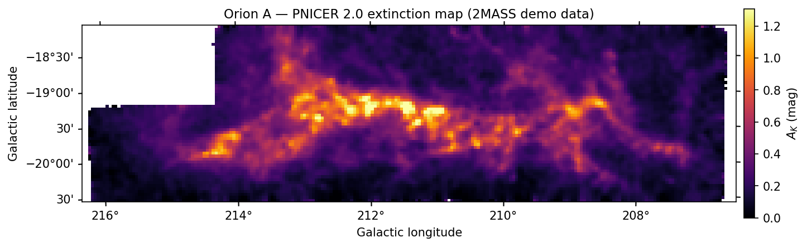

# PNICER

[](https://github.com/smeingast/PNICER/actions/workflows/ci.yml)
[](https://www.python.org)
[](LICENSE)
[](https://ui.adsabs.harvard.edu/abs/2017A%26A...601A.137M/abstract)

PNICER is an astronomical software package for estimating interstellar extinction toward individual sources and for creating extinction maps from photometric catalogs.



Version 2.0 is a from-scratch rewrite. It keeps the PNICER idea — per-source extinction *probability densities* derived from an extinction-free control field, without priors on the column density — but replaces the original numerical machinery with the closed-form Bayesian formalism of [Lombardi (2018), A&A 615, A174](https://ui.adsabs.harvard.edu/abs/2018A%26A...615A.174L/abstract) (XNICER):

- The intrinsic color distribution of the control field is modeled by a Gaussian mixture fitted with **extreme deconvolution** (Bovy et al. 2011), properly removing the photometric errors of the control field itself.
- Each science source gets an **analytic extinction posterior** (a 1-D Gaussian mixture), with measurement errors and missing bands treated exactly via projection matrices.
- The **adaptive population correction** (Lombardi 2018, Sect. 2.6) accounts for the change of the observed background population with increasing extinction (faint galaxies vanish first), removing the population bias at high column densities.
- The **NICER** estimator (Lombardi & Alves 2001) is included in the same interface, and extinction maps support the **NICEST** correction (Lombardi 2009).

The package is pure Python on top of numpy/scipy/astropy/scikit-learn, has no multiprocessing (and therefore also runs on Windows), and de-reddens about a million sources per second on a laptop.

> **Legacy:** the original implementation, as used since the 2017 paper, is preserved as the [v1.0 release](https://github.com/smeingast/PNICER/releases/tag/v1.0). Install it with `pip install git+https://github.com/smeingast/PNICER.git@v1.0`.

## Installation

```bash
pip install git+https://github.com/smeingast/PNICER.git
```

Requires Python ≥ 3.11. For plotting, install the optional extra: `pip install "pnicer[plot] @ git+https://github.com/smeingast/PNICER.git"`.

## Quick start

```python
from pnicer import Photometry

bands = {"J": ("Jmag", "e_Jmag"), "H": ("Hmag", "e_Hmag"), "Ks": ("Kmag", "e_Kmag")}
extinction = {"J": 2.5, "H": 1.55, "Ks": 1.0}   # A_band / A_Ks

science = Photometry.from_fits("orion.fits", bands=bands, extinction=extinction,
                               lon="GLON", lat="GLAT", frame="galactic")
control = Photometry.from_fits("control.fits", bands=bands, extinction=extinction,
                               lon="GLON", lat="GLAT", frame="galactic")

# NICER: point estimates
nicer = science.nicer(control)

# PNICER: full posteriors (fit the control field once, reuse the model)
model = control.fit_intrinsic_colors(random_state=0)
posterior = science.pnicer(model, adaptive=True)   # adaptive population correction

# Point estimates and a map
catalog = posterior.discretize()
emap = catalog.build_map(bandwidth=5 / 60, metric="gaussian", use_fwhm=True, nicest=False)
emap.save("orion_ak.fits")
emap.plot()
```

To try this on bundled 2MASS data of Orion A:

```python
from pnicer.demo import orion
orion()
```

Missing measurements are encoded as NaN throughout; sources need at least two observed bands (one color) for an estimate. Direct color-space input (without magnitudes) is supported through `pnicer.Colors`; the adaptive correction requires band magnitudes.

## Verification

The 2.0 estimators are validated by an extensive test suite (75 tests): closed-form posteriors against brute-force numerical integration; the extreme-deconvolution fit against Bovy's reference C implementation; NICER against the legacy v1.0 outputs (machine precision) and against the K=1 special case of the Bayesian machinery (identical to 2e-15 across all missingness patterns); map pixels — including the NICEST correction — against independent brute-force computation and the frozen legacy maps; and constant-extinction injection tests with ground truth, where the adaptive correction keeps the bias below 0.02 mag at A_K = 1–2 mag while classic estimators drift by ~0.1 mag.

To run the tests from a clone: `pip install -e ".[dev]" && pytest`.

## Citation

If you use PNICER in your research, please cite [Meingast, Lombardi & Alves (2017)](https://ui.adsabs.harvard.edu/abs/2017A%26A...601A.137M/abstract), and for the version 2.0 methodology also [Lombardi (2018)](https://ui.adsabs.harvard.edu/abs/2018A%26A...615A.174L/abstract):

```bibtex
@ARTICLE{2017A&A...601A.137M,
       author = {{Meingast}, Stefan and {Lombardi}, Marco and {Alves}, Jo{\~a}o},
        title = "{Estimating extinction using unsupervised machine learning}",
      journal = {\aap},
         year = 2017,
        month = may,
       volume = {601},
          eid = {A137},
        pages = {A137},
          doi = {10.1051/0004-6361/201630032}
}

@ARTICLE{2018A&A...615A.174L,
       author = {{Lombardi}, Marco},
        title = "{Optimal extinction measurements. I. Single-object extinction inference}",
      journal = {\aap},
         year = 2018,
        month = aug,
       volume = {615},
          eid = {A174},
        pages = {A174},
          doi = {10.1051/0004-6361/201832769}
}
```
